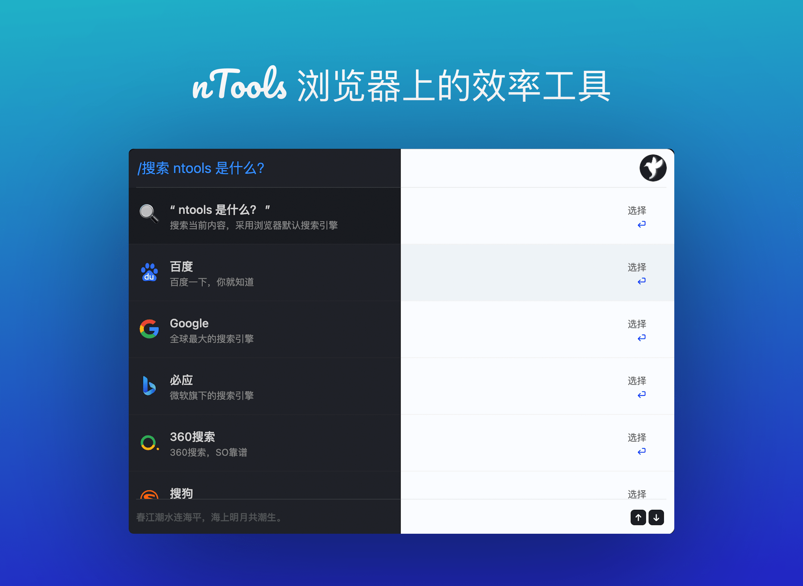

## nTools 是什么？

> 这是一款浏览器上的多功能效率工具

它是浏览器上可以提升效率的工具平台，可以在任何网页上弹窗输入命令和内容进行一些便携操作。
比如：快速操作浏览器功能、关闭多余标签、多个搜索引擎搜索、快速打开文档编写内容、内置 1000+ 常用网站快速打开。

## 如何使用

> 默认显示全部数据(搜索除外)，可以切换(指定)某个模块下的数据显示。

### 呼出窗口

- 右上角点击 nTools 图标
- **Mac** : `Option + Z`
- **Win** ：`Alt + Z`

### 命令

- **标签**：`/ta` 、`/标`
- **书签**：`/bo` 、`/书`
- **历史**：`/hi` 、`/历`
- **删除**：`/re` 、`/删`
- **操作**：`/se `、`/操`
- **搜索**：`/so` 、`/搜`
- **动作**：`/ac` 、`/动`
- **网站**：`/we` 、`/网`

## 部分演示

### 搜索内容

### 创建仓库

### 操作书签

### 常用站点

### 跳转标签

### 关闭标签

## 下载地址

- 官网：https://n.tools
- Chrome 商店：[点击下载](https://chrome.google.com/webstore/detail/ntools-%E6%95%88%E7%8E%87%E5%B7%A5%E5%85%B7%E7%AE%B1/mlihpcccijmdmkejmmjinppkjhdkfpnd?hl=zh-CN)

## 参考

借鉴了 Alfred、uTools、Omni 等系列软件